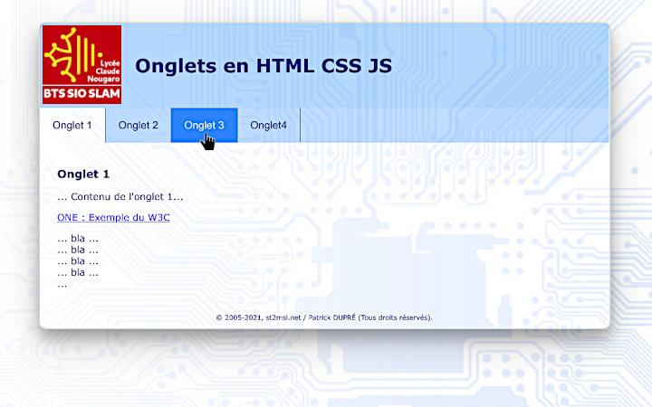

# ongletCSS
Des onglets avec HTML, CSS et Javascript 

## C'est déja mieux comme ça

# avec minCSS : impossible de faire plus court
Onglets en pure CSS
## principe : 2 lignes de css

div.onglets div:not(:target) {display: none}

div.onglets div:target {display: block}
